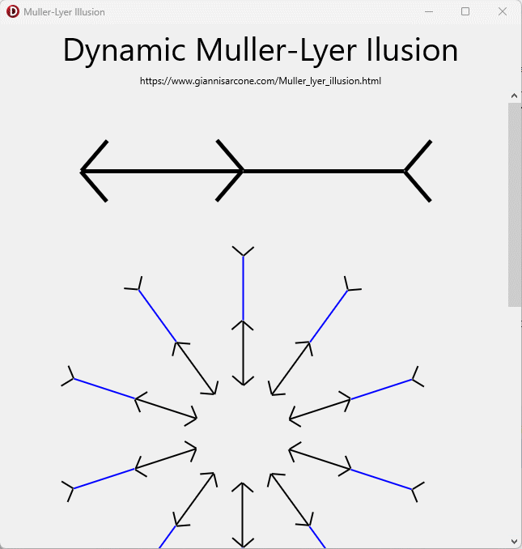

# Dynamic Müller-Lyer Illusion

implemented with Delphi Alexandria (c)2022 by [Paul TOTH](https://github.com/tothpaul)

based on [https://www.giannisarcone.com/Muller_lyer_illusion.html](https://www.giannisarcone.com/Muller_lyer_illusion.html)\
Copyright © G. Sarcone

Pointed out by Albert Moukheiber on [Facebook](https://www.facebook.com/513735070/videos/834999877744145/)

